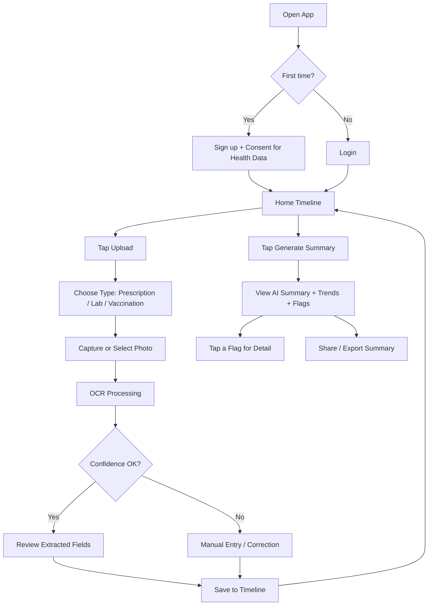

# User Flow — HealthVault

## Overview

## 1. Onboarding

1. User opens the app for the first time.
2. Sign-up screen with a clear, plain-language consent step for storing health data (naming the DPDP Act explicitly here is good for both the demo and real compliance).
3. Lands on an empty home timeline with a prompt to upload their first record.

## 2. Uploading a Record

1. User taps **Upload** from the home timeline.
2. Selects record type: Prescription, Lab Report, or Vaccination.
3. Captures a photo (camera) or picks one from gallery.
4. OCR runs; a brief loading state shows.
5. **If extraction confidence is high:** show the extracted fields pre-filled, user reviews and confirms.
6. **If confidence is low** (common for handwritten prescriptions): drop straight into a manual-entry form instead of showing likely-wrong data.
7. Record saves and appears on the timeline immediately.

## 3. Viewing the Timeline

1. Home screen shows all records chronologically, with type icons (prescription/lab/vaccination).
2. Filter/tab by type or date range.
3. Tapping a record opens its detail view (all extracted fields, plus the original scanned image for reference).

## 4. AI Summary & Flags

1. User taps **Generate Summary** (or it auto-refreshes when new records are added).
2. Summary screen shows: a plain-language overview, a trend section (e.g., a simple chart per repeated lab test), and a flags section.
3. Each flag shows the value, the exact threshold it crossed, and a "this isn't a diagnosis — consider discussing with a doctor" note.
4. User can tap a flag to see the underlying reading(s) it's based on.

## 5. Sharing

1. From the summary screen, user can export/share a PDF or plain-text version — useful to hand to a new doctor.

## Edge Cases to Handle

- OCR completely fails to read an image → prompt to retake photo or go straight to manual entry.
- User uploads a document that doesn't match the type they selected (e.g., picks "Lab Report" but uploads a prescription) → let them recategorize during review rather than forcing a re-upload.
- No records yet → summary screen should explain it needs at least one record instead of showing an empty/broken state.
